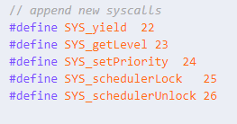

# Project1 - MLFQ Scheduler

- [Requirement](#requirement)
- [Design](#design)
- [Implement](#implement)
- [Result](#result)
- [Trouble Shooting](#trouble-shooting)

## Requirement

### MLFQ Scheduler

#### General

- 3-level feedback queue
- 우선순위가 높은것 부터 L0, L1, L2의 큐로 이루어짐
- L_n queue는 2n+4 ticks의 time quantum을 가짐
- 처음 실행된 프로세스는 L0에 들어감
- scheduler는
    - L0 queue의 RUNNABLE한 process 우선
    - 없으면 L1의 process
    - 없으면 L2의 process

#### L0, L1

- Round-Robin scheduling

#### L2

- priority scheduling
- 시스템 콜 setPriority()를 이용해 우선순위를 설정 가능하게
- priority는 값이 작을수록 우선순위가 높음
- process가 처음 실행될때 priority는 3으로 설정, setPriority()를 통해 0~3의 값을 설정가능
- 우선순위는 L2 큐에서만 영향이 있음
- Priority는 0이 최소
- 우선순위가 같으면 FCFS

### Priority Boosting

- Global tick이 100ticks가 될 때마다 모든 프로세스는 L0으로
- boosting이 될 때, 모든 process의 priority는 3으로
- boosting이 될 때, 모든 process의 time quantum이 초기화됨

### Scheduelr Lock & Unlock

- mlfq에 의해 scheduling되는 process보다 항상 우선적으로 처리되는 process를 관리
- 학번을 암호로 입력받음
- 암호가 일치하지 않으면 process를 강제로 종료. 이때 pid, time quantum, level of queue를 출력
- shceudler를 lock하는 프로세스가 있으면 mlfq는 동작하지 않아야 함

#### schedulerLock() - 129번 interrupt

- global tick은 priority boosting 없이 0으로 초기화
- 기존에 존재하는 프로세스만 호출 가능
- 호출한 process는 global tick이 100이 될 때 mlfq scheduler의 L0 맨 앞으로 이동하고 priority boosting이 발생

#### schedulerUnlock() - 130번 interrupt

- mlfq scheduler로 돌아감
- 해당 process는 L0의 제일 앞으로, priority는 3으로
- 해당 process의 tiem quantum은 초기화됨

### System Calls

#### void yield()

- 다음 프로세스에게 양보

#### int getLevel(void)

- process가 속한 queue의 level 반환

#### void setPriority(int pid, int priority)

- 해당 pid의 process의 priority를 설정

#### void schedulerLock(int password)

- scheduler lock을 설정

#### void schedulerLock(int password)

- scheduler unlock을 설정

## Design

---

deprecated

### Scheduler

- 프로세스가 생성될 때 L0 큐에 enqueue함
- L0부터 L2까지 탐색해서 RUNNABLE한 process가 있다면 scheduling해줌

#### L0, L1 Scheduling

- process가 일을 한 후, yield하면 usedtime을 증가시키고 해당 queue에서 dequeue
    - 만약 time quantum을 모두 사용했다면 다음 레벨에 enqueue
    - time quantum을 아직 다 사용하지 않았다면 같은 레벨에 다시 enqueue해서 다음 process가 scheduling될 수 있도록 함

#### L2 Scheduling

- queue의 앞에서부터 끝가지 보며 runnable하고, 앞쪽에 있으며 가장 우선순위가 높은 (priority가 작은) process를 찾아 실행
- L2 queue에서는 들어온 순서를 유지하기 위해 L0, L1에서와 달리 dequeue후 enqueue하는 과정을 수행하지 않음
- time quantum을 모두 사용했으면 priority 감소시킴

---

### New Scheduler

- 위의 design이 지나치게 복잡하여 더 간단한 방식을 고안함
- process를 `RUNNABLE`로 바꾸는 부분에서 mlfq에 집어넣음
- 만약 scheduling 가능한 process가 있다면 mlfq에서 제거하고 실행 → 다시 `RUNNABLE`이 되면 time quantum을 확인해 있어야 하는 레벨의 큐에 추가
- 이때 L2에서 piazza @81 질문처럼 동작하게 됨

### Lock & Unlock

- process가 scheduler를 lock하면 L0의 가장 앞으로 옮김
    - 기존 mlfq scheduler에서 L0의 가장 앞 process부터 확인하므로 lock한 process를 실행하게 됨
    - 이때 기존에는 dequeue 후 enqueue하지만 schedulerLock한 상태라면 다시 scheduler의 처음으로 돌아감
    - 이로 인해 unlock을 호출하거나 global ticks이 100이 되었을 때 별도의 queue간 이동을 처리해 주지 않아도 lock한 process가 L0의 가장 앞에 있게 됨
- L0의 가장 앞의 process, 즉 schedulerLock을 호출한 process가 runnable하지 않다면, schedulerLock을 해제하고 dequeue 후 다시 L0에 enqueue함

### New Lock & Unlock

- 위의 Lock & Unlock 방식에서는 lock 했음에도 계속 scheduler를 호출하며 context switch가 일어나기 때문에 매우 비효율적, 따라서 lock하면 특정 조건 만족시 말고는 다시 스케쥴러로 돌아오지 않는 새로운 방식을 고안함
- lock 할때 락한 프로세스를 현재 프로세스로 저장
- yield하려 할때 락이 걸려있으면 sched()를 호출하지 않고 계속 해당 프로세스를 실행함
- unlock호출시 L0의 제일 앞에 넣고 틱 초기화
- boosting시 lock된 상태라면 해제하기
- password가 일치하지 않는 경우에는 exit()으로 process를 종료했고, 그 외에 lock이 안됐는데 unlock하는 경우, 다른 process가 unlock하는 경우 등은 경고 메시지만 띄우고 그냥 return을 실행해 아무일도 하지 않음

### Priority Boosting

- 우선 schedulerLock이 되어있는 상태라면 해제해야 함
- L0부터 L2까지 탐색하면서 priority와 usedtime을 초기화시키고, L0로 옮김

## Implement

> ‘위 설명글 + 아래 코드’ 형식으로 작성하였습니다.
> 

### 변경된 코드

- usys.S
- Makefile
- sysproc.c
- syscall.c
- syscall.h
- trap.c
- traps.h
- proc.c
- proc.h
- param.h
- etc..

### Structures

#### queue

- 배열 큐를 만들고, 각각의 큐의 size와 timequantum 정보를 저장함, 추가로 각종 큐 연산을 위한 함수들을 정의 (enqueue, dequeue 등..)

```c
struct queue {
  struct proc *procs[NPROC+1]; // for remove from queue, +1
  int size;
  int timequantum;
};
```

#### proc

- 세개의 변수를 구조체에 추가

```c
struct proc {
	int priority;
	int usedtime;
	int level;
};
```

#### ptable

- scheduling 할 때 ptable.lock만 잡은 상태에서 진행하기 위해 ptable 안에 multilevel queue들과 schedulerLock을 호출한 process를 저장하는 변수를 추가

```c
struct {
  struct spinlock lock;
  struct proc proc[NPROC];
  struct proc *lockproc;
  struct queue L[3];
} ptable;
```

- 이후 pinit에서 추가한 변수들을 초기화해줌

### scheduling

#### mlfqscheduler

- 실행 가능한 process를 찾음

```c
struct proc* p = 0;
for(i = 0; i < 3; i++)
  if(ptable.L[i].size > 0){
    p = ptable.L[i].procs[0];
    break;
  }
```

- cpu를 할당받을 때 timequantum을 증가시키고 시간을 다 썼는지 검사해 레벨을 증가시킴

```c
if(p->usedtime >= ptable.L[p->level].timequantum){
  if(p->level < 2){ // in L0 and L1 queue
    p->usedtime = 0;
    p->level++; // will be enqueued in next queue later
  }
  else{ // in L2 queue
    p->usedtime = 0;
    if(p->priority > 0)
      p->priority--;
  }
}
```

#### priorityboosting

- trap.c에서 mlfq의 tick이 0이 될 때마다 priorityboosting을 호출함 (trouble shooting에 적은 sleep 무한대기 오류를 해결하기 위해 새로운 tick을 만듬)

```c
acquire(&tickslock);
acquire(&mlfqtickslock);

ticks++;
mlfqticks = (mlfqticks+1)%100;

if(mlfqticks == 0)
  priorityboosting();

wakeup(&ticks);

release(&mlfqtickslock);
release(&tickslock);
```

- process의 정보들을 재설정해주고, L1과 L2 queue에 있던 process들은 순서대로 L0 queue에 옮겨줌

```c
for(i = 0; i < 3; i++)
  for(s = 0; s < ptable.L[i].size; s++){
    p = ptable.L[i].procs[0]; // get front
    p->priority = 3;
    p->usedtime = 0;
    p->level = 0;
    if(i > 0){ // except in L0 queue
      dequeue(&ptable.L[i]);  
      enqueue(&ptable.L[0], p);
    }
  }
```

- boosting을 실행할 때 schedulerLock이 걸려있다면 해제해줌

```c
if(ptable.lockproc){
  p = ptable.lockproc;
  ptable.lockproc = 0;
  p->level = 0;
  p->usedtime = 0;
  p->priority = 3;
}
```

### Scheduler Lock & Unlock

#### schedulerLock

- lock을 호출할수 없는 경우를 거름
- 스케쥴러 lock을 처리하고 global tick을 초기화

```c
if(password != PASSWORD){
  cprintf("[!] invalid password in schedulerLock - pid: %d, timequantum: %d, level: %d\n", p->pid, p->usedtime, p->level);
  exit();
}

if(ptable.lockproc){
  // locked by this process
  if(ptable.lockproc->pid == p->pid){
    cprintf("[!] scheduler is already locked by this process\n");
    release(&ptable.lock);
    return;
  }
  // locked by another process
  else{
    cprintf("[!] shceudler is already locked by another process\n");
    release(&ptable.lock);
    return;
  }
}
```

```c
ptable.lockproc = p;

release(&ptable.lock);

// reset global ticks
acquire(&mlfqtickslock);
mlfqticks = 0; 
release(&mlfqtickslock);
```

#### schedulerUnlock

- 우선 위의 schedulerLock과 같이 unlock이 실행될 수 없는 경우를 거름
- 그리고 unlock시킨 뒤, 다시 스케쥴러로 돌아가게 함

```c
ptable.lockproc = 0;
p->level = 0;
p->usedtime = 0;
p->priority = 3;

// input in front of L0 queue
p->state = RUNNABLE;
insertqueue(&ptable.L[0], p);

// call sched for going to scheduler again
sched();
```

#### yield

- lock된 경우, return 실행

```c
// when lock process execute yield, don't execute context switch
if(ptable.lockproc){
  if(ptable.lockproc->pid == p->pid){ 
    release(&ptable.lock);
    return;
  }
}
```

### System Calls

#### setPriority

- 지정할 우선순위가 0~3이 아니라면 그대로 return함
- 바꿀 process를 ptable에서 찾은 후 변경

```c
void
setPriority(int pid, int priority)
{
  struct proc *p;

  // don't do setPriority if priority is invalid
  if(priority < 0 || priority > 3){
    cprintf("[!] invalid priority in setPriority");
    return;
  }
  
  // find proc and set new priority
  for(p = ptable.proc; p < &ptable.proc[NPROC]; p++)
    if(p->pid == pid){
      p->priority = priority;
			return;
	  }

  cprintf("[!] cannot find process\n");
}
```

#### getLevel

- 간단하게 레벨을 반환하도록 작성

```
int
getLevel(void)
{
  return myproc()->level;
}
```

#### tvinit

- tvinit에서 Lock, Unlock interrupt를 위해 trap vector 설정 추가

```c
void
tvinit(void)
{
  int i;

  for(i = 0; i < 256; i++)
    SETGATE(idt[i], 0, SEG_KCODE<<3, vectors[i], 0);
  SETGATE(idt[T_SYSCALL], 1, SEG_KCODE<<3, vectors[T_SYSCALL], DPL_USER);
  SETGATE(idt[T_LOCK], 1, SEG_KCODE<<3, vectors[T_LOCK], DPL_USER);
  SETGATE(idt[T_UNLOCK], 1, SEG_KCODE<<3, vectors[T_UNLOCK], DPL_USER);

  initlock(&tickslock, "time");
  initlock(&tickslock, "mlfqtime");
}
```

#### 기타

system call 실습 내용과 마찬가지로 시스템 콜을 추가하기 위해

- syscall.h에 syscall nubmer 추가



- syscall.c에 매핑 추가


- sysproc.c에 wrapper function 추가


- defs.h에 함수 추가


- user.h에 함수 추가


를 진행함

## Result

### 컴파일 및 실행

- gcc 9.4.0
- make 4.2.0
- 프로젝트 root directory에서 make.sh과 run.sh을 순서대로 실행

```
./make.sh
./run.sh
```

### 실행 결과

#### mlfq_test


#### yield

- if - else에서 parent가 yield 한 후, hello world를 출력하는 테스트 코드를 사용

```c
case '1':
  printf(1, "test - yield\n\n");
  
  if((pid = fork()) != 0){ // parent
    printf(1, "in parent, call yield\n");
    yield();
    printf(1, "hello world\n");
    wait();
  }
  else{ // child
    for(int i = 0; i < 5; i++){
      printf(1, "child %d\n", i);
    }
    exit();
  }
  break;
```

- 실행했을 때, 아래와 같이 yield하면 hello world가 자식이 출력한 후 나타남, 물론 경우에 따라 출력은 다르게 나타날 수 있지만 “call yield”를 출력 후 바로 “hello world”를 출력하는 상황은 나타나지 않음, 즉 yield가 정상적으로 수행되어 자식 프로세스로 cpu를 넘겨줌


test - yield result

#### schedulerLock

- 아래 코드에서 다음 내용을 확인하려 함
    1. schedulerLock을 호출하면 의도대로 그 process가 계속 일하는지
    2. lock을 건 상태로 priority boosting이 발생하면 lock이 정상적으로 풀리는지
    3. 이때 parent에서 i=1000일때 unlock해 제대로 동작하는지

```c
case '2':
  printf(1, "test - lock\n\n");

  if((pid = fork()) != 0){
    printf(1, "in parent, lock!\n");
    schedulerLock(password);
    for(int i = 0; i < 10000; i++){
      printf(1, " %d", i);
      if (i % 50 == 0)printf(1, "\n");
    }
    wait();
  }
  else{
    printf(1, "child..\n");
    for(int i = 0; i < 10000; i++){
      printf(1, " #");
      if (i % 50 == 0)printf(1, "\n");
    }
    exit();
  }
  break;
```

- 아래와 같이 parent가 계속 cpu를 할당받다가, boosting이 발생하면 child와 번갈아 cpu를 할당받게 됨.


lock result

- 3번을 확인하기 위해 fork pid ≠ 0일때 코드를 다음과 같이 수정함

```
if((pid = fork()) != 0){
  printf(1, "in parent, lock!\n");
  schedulerLock(password);
  for(int i = 0; i < 10000; i++){
    printf(1, " %d", i);
    if (i % 50 == 0)printf(1, "\n");
    if (i == 1000) schedulerUnlock(password);
  }
  wait();
}
```

- 이전의 출력 결과와 다르게 약 1000까지 출력한 이후 child process로 넘어감


lock & unlock result

#### setPriority

- 아래와 같이 실행시간이 긴  부모와 자식 프로세스를 같이 실행.
    
    ```c
    case '3':
      printf(1, "test - setpriority\n\n");
      if((pid = fork()) != 0){
        for(int i = 0; i < 10000; i++){
          printf(1, " p%d", i);
          if (i % 30 == 0) printf(1, "\n");
        }
        wait();
      }
      else{
        for(int i = 0; i < 10000; i++){
          printf(1, " c%d", i);
          if (i % 30 == 0) printf(1, "\n");
        }
        exit();
      }
      break;
    ```
    
- 이때 setpriority를 **하지 않았다면** parent와 child가 같이 queue를 내려가다, L2 큐에 가면 번갈아 가면서 실행, 그러다 time quantum을 다 사용해 parent의 priority가 내려가므로 p%d가 연속적으로 매우 많이 실행되어야 함. 실제로 아래 사진과 p와 c가 번갈아 가며 출력되다가, 어느 순간 p만 연속적으로 실행됨


- 위의 코드에서 아래와 같이 child process의 우선순위를 0으로 설정하는 코드를 추가

```c
case '3':
      printf(1, "test - setpriority\n\n");
      if((pid = fork()) != 0){
        setPriority(pid, 0);
        for(int i = 0; i < 2000; i++){
          printf(1, " p%d", i);
          if (i % 30 == 0) printf(1, "\n");
        }
        wait();
      }
      else{
        for(int i = 0; i < 2000; i++){
          printf(1, " c%d", i);
          if (i % 30 == 0) printf(1, "\n");
        }
        exit();
      }
      break;
```

- 그랬더니 이전과 반대로 번갈아가며 실행되다 c가 어느 기점에서 c만 연속적으로 실행됨


- 이를 통해 setPriority가 제대로 동작함을 알 수 있음

## Trouble Shooting

#### mlfq_test.c 추가시 make가 안되는 문제

- 문제: make시 아래와 같은 메시지 발생
    
    
    
- 해결: 우선 syscall.c에 함수 포인터 등록을 안해주어서 이를 수정하고, 그럼에도 실패해서 system call function과 wrapper function의 이름, system call 번호를 define한 항목 이름을 같게 했더니 성공적으로 make됨

#### mlfq_test에서 getLevel의 결과로 0이 나오지 않던 문제

- 원인: priorityboosting()에서 process들을 L0으로 옮길 때, process의 level을 변경하지 않아 0이 return되지 않았음
- 해결: boosting에서 0으로 레벨 변경되게 적어줌

#### schedulerLock & unlock 호출 시 init.c의 “zombie!”가 출력되는 문제

- 원인: init.c의 35줄에서 main process가 자식 process를 기다리고 있고, 기다리고 있는 process의 pid가 fork해서 만든 process의 pid와 다를떄 zombie!를 출력
- 해결: unlock시 입력받은 password가 유효할 때 process를 종료시키고 있었음

#### lock 방식을 변경했더니 schedulerLock 호출시 이미 lock을 잡고 있는 것으로 판정되었던 문제

- 문제: 아래 코드에서 조건이 만족되지 않음에도 if문 안으로 들어감
    
    ```c
    struct proc *p = myproc();
    if(ptable.lockproc && ptable.lockproc->pid != p->pid){
    	cprintf("already locked by other process");
    }
    ```
    
- 해결: 아래 코드처럼 ptable.lockproc을 먼저 검사한 후에, 뒤 조건을 검사하니 제대로 작동함. 다만 앞의 조건문이 false면 &&에서 바로 탈출하는 것으로 알고 있었는데, 어떻게 if 안으로 들어가게 된 것인지는 잘 이해하지 못함
    
    ```c
    struct proc *p = myproc();
    if(ptable.lockproc){
    	if(ptable.lockproc->pid != p->pid){
    		cprintf("already locked by other process");
    	}
    }
    ```
    

#### zombie panic

- 문제: lock을 한 후, 어떠한 이유로 queue에 zombie state의 process가 들어가 panic이 발생하던 문제
- 원인: unlock에서 p의 state를 `RUNNABLE`로 만들고 L0의 제일 앞에 insert 했을때 큐에 들어간 상태로 일을 계속 하기 때문에 좀비가 되면 다음에 스케쥴러에서 `ZOMBIE` 상태인 unlock을 호출한 process를 스케쥴링 하게 된 상태였음
- 해결: schedulerUnlock insertqueue 한 다음에 sched()를 호출해 더이상 실행하지 않고 다시 스케쥴러로 돌아가게 함

#### sleep의 인자로 100 이상의 숫자를 넘겨주면 작동이 멈추는 문제

- 원인: sys_sleep에서 ticks와 인자를 비교해 기다리기 때문에 100 이상의 수를 넘겨주면 기존 로직에서 ticks가 0부터 99까지의 값을 가지므로 while문을 계속 돌아 작동이 멈추게 됨
- 해결: trap.c에 새로운 mlfqticks 변수를 선언해 사용. 기존 ticks는 그대로 두어 sleep이 제대로 작동하게 하고, mlfqticks는 0~99의 값을 가지며 boosting, lock 시에 0으로 리셋 등의 작업을 하도록 함
