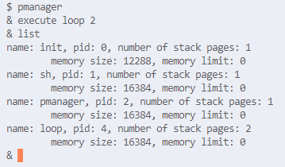

[Home](../README.md)

# Project2 - Process Management & LWP

- [Design](#design)
- [Implement](#implement)
- [Result](#result)
- [Trouble Shooting](#trouble-shooting)

## Design

### Process Management

#### exec2

- 기존 exec을 그대로 쓰고, 스택 페이지를 할당하는 부분만 stacksize를 이용

#### setmemorylimit

- struct proc에 memorylimit을 추가해 관리

#### pmanager

- 입력받은 명령 한줄을 파싱하는 함수를 만들어 관리
- 각 명령어 별로 해당하는 시스템 콜을 호출

### LWP

- struct proc에 mainthread를 추가해서 스레드의 mainthread가 누구인지 알 수 있게 하기
- mainthread의 sz를 이용해 새로 allocuvm 할때 어디서부터 할당해야 할지 결정할 수 있게 함

#### thread_create

- fork할때 처럼 allocproc한 후, thread_create에서 나머지 작업을 수행
- mainthread에서 정보를 얻어 다음 할당할 수 있는 스택 페이지 주소를 얻어 새로운 스레드를 위한 유저 스택을 할당
- eip를 start_routine으로 설정하고 arg도 넣기

#### thread_exit

- exit()과 유사하게 작동

#### thread_join

- wait()과 유사하게 작동

## Implement

### Process Managemnet

#### exec2

- 2 → stacksize+1로 변경된 부분만 기존의 exec()과 다름

```c
sz = PGROUNDUP(sz);
if((sz = allocuvm(pgdir, sz, sz + (stacksize+1)*PGSIZE)) == 0)
  goto bad;
// make inaccesible page (guard page)
clearpteu(pgdir, (char*)(sz - (stacksize+1)*PGSIZE));
sp = sz;
```

#### setmemorylimit

- 인자로 받은 pid를 가지고, tid가 0인, 즉 mainthread인 process에 대해 memorylimit 변수를 수정함

```c
for(p = ptable.proc; p < &ptable.proc[NPROC]; p++)
  if(p->pid == pid && p->tid == 0){
    if(p->sz > limit){
      cprintf("allocated memory is less than new limit\n");
      release(&ptable.lock);
      return -1;
    }
    p->memorylimit = limit;
    break;
	}
```

#### pmanager

- 우선 다음과 같은 함수를 만듬 (system call x)
    - int getcmd(char *buf, int nbuf)
        - pmanager에서 반복해서 command를 입력받을 때 사용하는 함수
        - gets로 한 줄을 입력받고, 마지막 줄바꿈 문자를 지움
        - 실패하면 -1을, 성공하면 0을 반환함
    - char *getword(char *buf, char *word, int nword)
        - buf의 문자열로부터 공백을 기준으로 하나의 단어를 word에 저장하는 함수
        - buf 문자열에서 더이상 읽을 단어가 없으면 0을 반환함
    - int stoi(char *str, int *res)
        - str를 정수로 바꿔 res에 저장하는 함수
        - 실패하면 -1을, 성공하면 0을 반환함
- strcmp를 이용해 command를 나누고, 각각의 경우에 다음과 같이 명령을 수행함
    - list
        - 새로 추가한 시스템 콜 showprocs()를 실행해 실행중인 프로세스들의 정보를 출력
            
            ```
            void
            showprocs(void)
            {
              struct proc *p;
            
              acquire(&ptable.lock);
              for(p = ptable.proc; p < &ptable.proc[NPROC]; p++){
                if(p->tid) continue; // skip when p is subthread
                if(p->state == RUNNABLE || p->state == RUNNING || p->state == SLEEPING){ // print only runnable or running process
                  cprintf("name: %s, pid: %d, number of stack pages: %d\n", p->name, p->pid, p->stacksize);
                  cprintf("\tmemory size: %d, memory limit: %d\n", p->totalsize, p->memorylimit);
                }
              }
              release(&ptable.lock);
            }
            ```
            
    - kill: kill(pid)를 호출
    - memlim: setmemorylimit을 호출
    - execute
        - 새로 만든 exec2 시스템 콜을 이용해 exec을 수행함.
        - 이때 exec한 프로세스를 백그라운드에서 수행되게 하기 위해 아래와 같이 pmanager의 자식을 만들고, 자식에서 손자를 만들어 손자에서 exec한 후, 자식을 종료해 pmanager와 독립적으로 수행되고, 나중에 종료되면 init이 수거해 가도록 함
        
        ```
        if(fork() == 0){
          if(fork() == 0){
            exec2(arg0, argv, stacksize);
            printf(2, "exec failed\n");
            exit();
          }
          else{
            exit();
          }
        }
        ```
        
    - exit: pmanager를 종료

### LWP

#### struct proc

- `mainthread` thread들의 main thread를 나타냄. sub thread들이 allocuvm 등의 작업을 할 때 mainthread에 저장된 정보를 이용함
- `memorylimit` setmemorylimit을 통해 부여할 memory 최대치를 저장
- `stacksize` mianthread가 가지고 있는 stack page의 개수를 저장
- `tid` thread의 id, nextpid와 같이 thread_create가 호출될 때마다 1씩 증가하면서 붙여지며, mainthread는 0의 tid를 가짐
- `retval` thread_exit을 호출할 때 반환값을 저장하기 위한 항목

```c
struct proc {
	...
  struct proc *mainthread;
	int memorylimit;
  uint stacksize;
  thread_t tid;
  void *retval;
};
```

#### thread_create

- allocproc을 이용해 할당 가능한, UNUSED인 process를 찾음
- fork할 때 처럼 copyuvm으로 복사하지 않고, pgdir 값을 대입해 thread와 mainthread가 같은 주소 공간을 가리키게 함

```c
// np->pgdir = copyuvm(curproc->pgdir, curproc->sz)
np->pgdir = mainthread->pgdir;
```

- parent를 mainthread의 parent로 설정, 즉 pid가 같으면 스레드들은 같은 프로세스를 부모로 가짐

```c
np->parent = mainthread->parent;
```

- 새로 스택 페이지를 할당했을때 memorylimit보다 크기가 커지면 종료하고, 그렇지 않다면 페이지 두개를 할당해 하나는 스택 페이지, 하나는 가드용 페이지로 사용

```c
if(mainthread->memorylimit && mainthread->sz + 2*PGSIZE > mainthread->memorylimit){
  return -1;
}
if((np->sz = allocuvm(np->pgdir, np->sz, np->sz + 2*PGSIZE)) == 0){
  return -1;
}
clearpteu(np->pgdir, (char*)(np->sz - 2*PGSIZE));
```

- 그 후, 페이지 두개를 할당한 이후 갱신된 sz를 mainthread에 적용하고, totalsize 증가시키며 새로 만드는 thread의 trap frame (eip, esp)를 갱신하며 인자를 넣음

```c
mainthread->sz = np->sz;

np->tf->esp = np->sz - 8;
ustack[1] = (uint)arg;
ustack[0] = 0xffffffff;

if(copyout(np->pgdir, np->tf->esp, ustack, 8) == -1){
  return -1;
}

np->tf->eip = (uint)start_routine;
```

- thread의 값을 tid로 지정하고 thread_create를 종료함

```c
*thread = np->tid;
```

#### thread_exit

- exit하는 thread의 retval을 인자로 받은 retval로 설정하고, tid를 인자로 wakeup1을 호출해 자신의 tid를 인자로 sleep을 호출해 자고 있는 thread를 깨움

```c
curproc->retval = retval;

wakeup1((void*)curproc->tid);
curproc->state = ZOMBIE;
```

#### thread_join

- tid가 thread인 thread를 찾으면 cleanthread를 호출해 정리함

```
for(p = ptable.proc; p < &ptable.proc[NPROC]; p++){
  if(p->tid != thread)
    continue;
  havekids = 1;
  if(p->state == ZOMBIE){
    *retval = p->retval;
    
    cleanthread(p);
    
    release(&ptable.lock);
    return 0;
  }
}
```

- 스레드는 찾았지만 아직 종료되지 않았으면 그 스레드의 tid(= thread)를 인자로 sleep에 들어감

```c
sleep((void*)thread, &ptable.lock);
```

#### exit

- 만약 같은 프로세스의 thread중 하나가 exit()을 호출하면 나머지 thread들은 모두 정리가 되어야 함
- 이를 처리하기 위해 exit에 다음과 같이 pid가 같은 자신 이외의 다른 thread들을 정리하는 과정을 추가함

```c
for(p = ptable.proc; p < &ptable.proc[NPROC]; p++){
  if(p->pid == curproc->pid && p != curproc){
    p->state = ZOMBIE;
    cleanthread(p);
  }
}
```

- exit을 호출한 thread는 원래 exit() 처럼 zombie가 되고 parent를 wakeup시키며 처리될 것

#### exec

- exec 할 때도 exit 할때와 마찬가지로 프로세스 내의 자신 이외의 다른 thread들을 정리함
- 이를 위해 cleanforexec 함수를 만들어 exec 내에서 호출함

```c
void cleanforexec()
{
  struct proc *p;
  struct proc *curproc = myproc();

  acquire(&ptable.lock);

  for(p = ptable.proc; p < &ptable.proc[NPROC]; p++){
    if(p->pid == curproc->pid && p != curproc){
      p->state = ZOMBIE;
      cleanthread(p);
    }
  }

  release(&ptable.lock);
}
```

#### growproc

- mainthread의 memorylimit을 확인해 growproc을 진행함

```c
sz = curproc->mainthread->sz;
if(curproc->mainthread->memorylimit && sz + n > curproc->mainthread->memorylimit)
  return -1;
...
curproc->mainthread->sz = sz;
```

## Result

- project2 폴더에 작성함
- root directory에서 아래 쉘 스크립트로 make하고 실행

```c
./make.sh 2
./run.sh 2
```

### pmanager

- loop 유저 프로그램은 while(1)을 도는 프로그램임
- execute loop 2로 실행하고, list를 출력하면 제대로 출력됨



pmanager - list & execute

- 4번 process에 대해 memlim을 했을때 실패 및 성공


pmanager - memlim

- kill process


pmanager - kill

### LWP


thread_test


thread_exec


thread_exit


thread_kill

## Trouble Shooting

#### thread를 만든 뒤 메인 thread가 종료되고 새로운 thread도 제대로 실행되지 않음

- 원인: allocthread 함수에서 np를 새로 runnable로 등록할 process로 사용했는데, np의 context를 memset에서 0으로 초기화해야 하는데, thread_create를 호출한 process, 즉 p의 context를 0으로 초기화하고 있었음

#### thread_create 후에 main.c의 main이 다시 실행되어 처음부터 다시 부팅됨

```c
#include "types.h" // thread_create test
#include "user.h"

void* hello(void * arg){
    printf(2, "Hello Thread!\n");
    sleep(100000000);
    printf(2, "thread awake\n");
    return 0;
}

int
main(int argc, char *argv[])
{
    thread_t t[3];
    for(int i = 0; i < 1; i++){
        thread_create(&t[i], hello, 0);
        printf(2, "thread created: [%d]\n", t[i]);
    }
		exit();
}
```

- 새로 만든 thread는 정상적으로 돌아가는 것으로 보임
- main 함수가 끝나면, 즉 thread_create를 호출한 process가 종료되면 xv6가 재부팅되는 것으로 확인됨 (아래와 같이 wait을 하지 않고 exit하면 재부팅됨)

```c
#include "types.h"
#include "user.h"

#define NTHD 3

void* hello(void * arg){
    printf(1, "Hello Thread! %d\n", (int)arg);
    sleep(100);
    exit();
    return 0;
}

int
main(int argc, char *argv[])
{   
    thread_t t[NTHD];
    for(int i = 0; i < NTHD; i++){
        thread_create(&t[i], hello, (void*)i);
        printf(1, "thread created: [%d]\n", t[i]);
    }
    for(int i = 0; i < NTHD; i++){
        printf(1, "wait pid: %d\n", wait());
    }
    exit();
}
```

- (위의 프로그램을 cthread라고 하면) cthread가 exit하면 부모, 즉 shell이 wait하다가 cthread에 의해 깨어나 cthread의 자원을 회수하게 됨. 이때 freevm을 호출해 pgdir를 회수하는데, 이때 subthread는 아직 죽지 않은 상태일 수 있기 때문에 pgdir을 이용해야 하는데 존재하지 않아 xv6가 재부팅되는 것으로 추정.
- 이를 해결하기 위해 exit의 코드를 수정해 다른 thread들을 정리한 다음에 자신의 exit 처리를 하도록 함

#### thread_join에서 sleep 한 이후, thread가 thread_exit을 해도 깨어나지 않던 문제

```c
void thread_exit(...){
	struct proc *curproc = myproc();
	...
	wakeup1(curproc);
	...
}

int thread_join(thread_t thread, ...){
	struct proc *p;
	...
	sleep(p, &ptable.lock);  //p: tid가 thread인 process
	...
}
```

- 위와 같이 작성했을 때, wakeup1에서 깨어나지 않아 curproc과 p를 %p로 출력해 보았더니 같은 tid의 스레드임에도 다른 주소를 가리킴
- 이때 thread_join의 p가 &ptable.proc[NPROC]과 같은 것을 확인함
- 이유를 생각해 보니, wait() 함수를 가져와 거의 비슷하게 사용했는데, wait() 함수에서는 parent가 자신인 자식 process가 여러개 있을 수 있기 때문에 ptable.proc을 전부 돈 후에 나옴
- 이를 해결하기 위해 간단히 ZOMBIE인 자식 thread를 찾았을 때, for문을 탈출하게 코드를 수정
- 또는 아래와 같이 thread id를 채널로 수정하는 방법도 해보았더니 잘 작동됨

```c
void thread_exit(...){
	struct proc *curproc = myproc();
	...
	wakeup1((void*)curproc->tid);
	...
}

int thread_join(thread_t thread, ...){
	...
	sleep((void*)thread, &ptable.lock);
	...
}
```