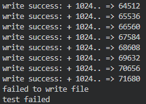

[Home](../README.md)

# Project3 - Multi Indirect & Symbolic Link

- [Design](#design)
- [Implement](#implement)
- [Result](#result)
- [Trouble Shooting](#trouble-shooting)

## Design

### Multi Indirect

- dinode와 inode의 addrs 배열의 길이를 두개 늘려 하나를 double indirect, 하나를 triple indirect로 사용
- bmap 함수에서 single indirect를 처리하는 방법과 유사하게 multi indirect를 추가

### Symbolic Link

- symbolic link를 진행하면 원본 파일의 path를 저장하고 있는 inode를 create하고, sys_open에서 심볼릭 링크 파일이면 path로 파일을 다시 열게 하기
- ls시에는 원본 파일을 열지 않고 심볼릭 링크 파일에 대한 정보를 가져오기

### Sync

- end_op에서 outstanding = 0인 경우 무조건 comit을 하고 있는데, 이 부분을 고치기

## Implement

### Multi Inidirect

#### struct dinode

```c
#define NDINDIRECT (NINDIRECT * NINDIRECT) // max of double indirect
#define NTINDIRECT (NINDIRECT * NINDIRECT * NINDIRECT) // max of triple indirect
#define MAXFILE (NDIRECT + NINDIRECT + NDINDIRECT + NTINDIRECT)

struct dinode {
	...
	uint addrs[NDIRECT+3];
}
```

#### bmap

- 아래와 같이 NINDIRECT보다 큰 bn이 들어왔을 시, NDINDIRECT 또는 NTINDIRECT의 크기와 비교해 검사하고, multi indirect를 수행함

```c
if(bn < NDINDIRECT){
  uint dindex = bn / NINDIRECT;
  uint index = bn % NINDIRECT;

  // allocate double indirect block
  if((addr = ip->addrs[NDIRECT+1]) == 0)
    ip->addrs[NDIRECT+1] = addr = balloc(ip->dev);

  // get double indirect block data
  dbp = bread(ip->dev, addr);
  d = (uint*)dbp->data;

  // allocate indirect block in double indirect block
  if((addr = d[dindex]) == 0){
    d[dindex] = addr = balloc(ip->dev);
    log_write(dbp);
  }

  // get indirect block data
  bp = bread(ip->dev, addr);
  a = (uint*)bp->data;

  // allocate direct block in indirect block
  if((addr = a[index]) == 0){
    a[index] = addr = balloc(ip->dev);
    log_write(bp);
  }

  brelse(bp);
  brelse(dbp);
  return addr;
}
bn -= NDINDIRECT;

if(bn < NTINDIRECT){
  uint tindex = bn / NDINDIRECT;
  uint dindex = (bn % NDINDIRECT) / NINDIRECT;
  uint index = (bn % NDINDIRECT) % NINDIRECT;

  // allocate triple indirect block
  if((addr = ip->addrs[NDIRECT+2]) == 0)
    ip->addrs[NDIRECT+2] = addr = balloc(ip->dev);

  // get triple indirect block data
  tbp = bread(ip->dev, addr);
  t = (uint*)tbp->data;

  // allocate double indirect block in triple indirect block
  if((addr = t[tindex]) == 0){
    t[tindex] = addr = balloc(ip->dev);
    log_write(tbp);
  }

  dbp = bread(ip->dev, addr);
  d = (uint*)dbp->data;

  // allocate indirect blocin in double indirect block
  if((addr = d[dindex]) == 0){
    d[dindex] = addr = balloc(ip->dev);
    log_write(dbp);
  }

  bp = bread(ip->dev, addr);
  a = (uint*)bp->data;
  
  if((addr = a[index]) == 0){
    a[index] = addr = balloc(ip->dev);
    log_write(bp);
  }

  brelse(bp);
  brelse(dbp);
  brelse(tbp);
  return addr;
}
```

#### itrunc

- 아래와 같이 double indirect 및 triplel indirect에 해당하는 addrs가 존재한다면 정보를 비움

```c
// trunc double indirect address
if(ip->addrs[NDIRECT+1]){
  // read double indirect block
  dbp = bread(ip->dev, ip->addrs[NDIRECT+1]);
  d = (uint*)dbp->data;

  // for each indirect block in double indirect block
  for(i = 0; i < NINDIRECT; i++){
    if(d[i]){
      // read indirect block
      bp = bread(ip->dev, d[i]);
      a = (uint*)bp->data;

      // for each direct block in indirect block
      for(j = 0; j < NINDIRECT; j++){
        // free direct lock
        if(a[j])
          bfree(ip->dev, a[j]);
      }
      // free indirect block
      brelse(bp);
      bfree(ip->dev, d[i]);
    }
  }
  // free double indirect block
  brelse(dbp);
  bfree(ip->dev, ip->addrs[NDIRECT+1]);
  ip->addrs[NDIRECT+1] = 0;
}

// trunc triple indirect address
if(ip->addrs[NDIRECT+2]){
  // read triple indirect block
  tbp = bread(ip->dev, ip->addrs[NDIRECT+2]);
  t = (uint*)tbp->data;

  // for each double indirect block in triple indirect block
  for(k = 0; k < NINDIRECT; k++){
    if(t[k]){
      // read double indirect block
      dbp = bread(ip->dev, t[k]);
      d = (uint*)dbp->data;

      // for each indirect block in double indirect block
      for(i = 0; i < NINDIRECT; i++){
        if(d[i]){
          // read indirect block
          bp = bread(ip->dev, d[i]);
          a = (uint*)bp->data;

          // for each direct block in indirect bock
          for(j = 0; j < NINDIRECT; j++){
            // free direct block
            if(a[j])
              bfree(ip->dev, a[j]);
          }
          // free indirect block
          brelse(bp);
          bfree(ip->dev, d[i]);
        }
      }
      // free double indirect block
      brelse(dbp);
      bfree(ip->dev, t[k]);
    }
  }
  // free triple indirect block
  brelse(tbp);
  bfree(ip->dev, ip->addrs[NDIRECT+2]);
  ip->addrs[NDIRECT+2] = 0;
}
```

### Symbolic Link

#### struct inode & struct dinode

- char path[16]을 추가

#### sys_slink

- 새로 추가한 시스템 콜로, symbolic link를 할때 slink()로 호출함.
- 기존 link와 인자는 같으며, 새로운 inode를 create하고, path를 old로 저장함

```c
int
sys_slink(void)
{
  char *new, *old;
  struct inode *ip, *np;

  if(argstr(0, &old) < 0 || argstr(1, &new) < 0)
    return -1;

  begin_op();

  // get inode of old file
  if((ip = namei(old)) == 0){
    end_op();
    return -1;
  }

  ilock(ip);
  if(ip->type == T_DIR){
    iunlockput(ip);
    end_op();
    return -1;
  }
  iunlock(ip);

  // create inode which is symbolic link file in np
  np = create(new, T_SYM, 0, 0);
  if(np == 0){
    end_op();
    return -1;
  }

  strncpy(np->path, old, DIRSIZ); // set path
  iupdate(np);
  iunlockput(np);
  
  end_op();

  return 0;
}
```

#### sys_open

- 아래와 같이 열려는 파일이 T_SYM 타입이면 원본 파일을 다시 open함

```c
while(ip->type == T_SYM){
  // re-open redirecting file
  if((rp = namei(ip->path)) == 0){
    // failed to redirect file
    cprintf("redirect file is not exist\n");
    iunlockput(ip);
    end_op();
    return -1;
  }
  iunlockput(ip);
  ip = rp;
  ilock(ip);
}
```

#### stat & sys_lsopen

- ls 커맨드 시에 symbolic link 파일이 아닌 원본 파일의 정보를 표시하는 문제를 해결하기 위해 stat함수에서 사용하는 open 대신 새로운 시스템 콜 lsopen을 추가해 호출함
- lsopen은 기존의 open과 동일함 (T_SYM 타입일때 redirect 하지 않음)

```c
int
stat(const char *n, struct stat *st)
{
  int fd;
  int r;

  fd = lsopen(n, O_RDONLY);
  if(fd < 0)
    return -1;
  r = fstat(fd, st);
  close(fd);
  return r;
}
```

### Sync

#### end_op

```c
void
end_op(void)
{
  int do_commit = 0;

  acquire(&log.lock);
  log.outstanding -= 1;
  if(log.committing)
    panic("log.committing");
  
  if(log.outstanding > 0){
    wakeup(&log);
  } else if(log.lh.n + MAXOPBLOCKS > LOGSIZE){ // if sync is needed
    do_commit = 1;
  }
  release(&log.lock);

  if(do_commit){
    sync();
  }
}
```

- 기존처럼 log.outstanding == 0일때 commit하지 않음
- 모든 transaction이 끝나고, 즉 log.outstanding이 0인 상황에서, 현재 log.lh.n과 MAXBLOCKS를 더한 값이 LOGSIZE보다 큰지 검사한다. 즉, 다음 begin_op가 호출되었을 때 공간이 부족해 transaction이 시작하지 못할 상황이라면 sync를 호출해 buffer를 비워준다.

#### sync

```c
int
sync(void)
{
  int n = log.lh.n;

  acquire(&log.lock);
  log.committing = 1;
  release(&log.lock);

  commit();

  acquire(&log.lock);
  log.committing = 0;
  wakeup(&log);
  release(&log.lock);

  return n;
}
```

- log.committing을 변경하고, commit을 진행하며, 그다음에 buffer의 공간이 부족해 sleep하고 있던 process를 깨우기 위해 wakeup(&log)를 호출한다.

## Result

### Multi Indirect

```c
#include "types.h"
#include "user.h"
#include "stat.h"

#define BUFFERSIZE 1024

int
main(int argc, char *argv[])
{
  int datasize = 16*1024*1024;
  int flag = 0;
  uint written = 0;
  char buf[BUFFERSIZE];
  int fd = open("double.txt", 0x200 | 0x002);

  if(fd == -1){
    printf(2, "failed to open file\n");
    exit();
  }

  int cnt = 0;
  int time = uptime();
  while(written < datasize){
    uint temp = write(fd, buf, BUFFERSIZE);
    if(temp == -1){
      printf(2, "failed to write file\n");
      flag = 1;
      break;
    }
    written += temp;
    cnt++;
    if(cnt % 50 == 0) // for doing not print too much progress
      printf(1, "write success: + %d.. => %d\n", temp, written);
  }

  if(flag){
    printf(2, "test failed\n");
    exit();
  }

  printf(1, "written = %d bytes | taken time: %d ticks\n", written, uptime()-time);

  if(close(fd) == -1){
    printf(2, "failed to close file\n");
    exit();
  }

  printf(1, "test success\n"); 
  exit();
}
```

- 파일을 열고 16MB 만큼의 데이터를 write하는 테스트 코드를 만듬
- 기존 xv6에서 해당 테스트 코드를 돌리면 아래와 같이 70KB를 초과해서 write하지 못함



- multi indirect를 구현한 후, 해당 테스트 코드를 돌렸더니 아래와 같이 성공적으로 16MB를 전부 씀


### Symbolic Link

#### hard link test

- 하드 링크로 파일을 생성하고 ls로 확인시 정상적으로 출력됨

```
$ ln README a
$ ln -h README b
$ ls
```


- 두 파일 전부 정상적으로 읽을 수 있음

```
cat a
cat b
```

- 원본 파일을 지워도 a 파일을 읽을 수 있음 (b도 마찬가지)

```
rm README
cat a
```


#### symbolic link test

- 심볼릭 링크 파일을 만들고, ls로 확인 시 원본 파일의 정보가 아닌 심볼릭 링크 파일의 정보를 정상적으로 출력함

```
ln -s README a
ls
```


- symbolic link 파일을 rm으로 삭제할 시, 원본파일이 아니라 정상적으로 symbolic link 파일을 삭제함

```
ln -s README a
rm a
cat README
```


- 원본 파일을 삭제시, symbolic link 파일이 원래 파일을 열지 못함

```
ln -s README a
rm README
cat a
```


### Sync

- 아래와 같이 test.c 파일에서 while문 안쪽에 일정 횟수 write시 sync를 호출하고 return 값을 출력하는 코드를 추가함

```c
while(written < datasize){
    uint temp = write(fd, buf, BUFFERSIZE);
    if(temp == -1){
      printf(2, "failed to write file\n");
      flag = 1;
      break;
    }
    written += temp;
    cnt++;
    if(cnt % 3 == 0){
      printf(1, "sync returned %d\n", sync());
    }
    // if(cnt % 50 == 0)
      // printf(1, "write success: + %d.. => %d\n", temp, written);
  }
```

- 또한 임시로, `commmit` 함수에 `cprintf("commit!\n");` 를 추가해 sync가 얼마나 발생하는지 알 수 있게 함.
- cnt % 3 == 0으로 둘 시 test 실행시 아래와 같이 유저 프로그램 test에서 sync를 호출할 때만 commit이 발생함


- sync를 호출하는 조건을 cnt % 20 == 0으로 고치면, 즉 sync를 덜 호출하면 아래와 같이 유저가 sync를 호출하는 상황을 제외하고도 버퍼가 부족한 상황에서도 sync를 호출해 commit하게 됨


- `begin_op`와 `end_op`를 고치지 않은 상황에서 조건을 cnt % 3 == 0으로 두고 test를 실행시 한 프로세스에서 계속 write하는 상황이기 아래와 같이 매우 빈번하게 commit하게 됨


- 이를 통해 한 프로세스가 연속적으로 write를 수행하는 경우 디스크에 commit하는 과정을 더 적게 수행하게 되었음을 알 수 있음.

## Trouble Shooting

#### multi indirect test시 out of blocks panic이 발생하는 문제

- 원인: fs.c에서 매크로를 아래와 같이 작성했었고, 이때문에 bmap에서 `bn / NDINDIRECT`를 계산하는 과정에서 의도치 않은 결과가 나오게 됨

```c
#define NDINDIRECT NINDIRECT * NINDIRECT // max of double indirect
#define NTINDIRECT NINDIRECT * NINDIRECT * NINDIRECT // max of triple indirect
```

- 해결 macro를 괄호로 감싸서 해결

#### symbolic link를 구현중, ilock에서 ip→type = 0에 걸리던 문제

- 우선 처음에는 ialloc을 사용해 symbolic link 파일을 만들고 있었음
- 이때 ip→nlink를 건드리지 않았는데 않았는데, 이때문에 ialloc으로 inode를 만들고, T_SYM으로 타입을 수정한 후에 iput(ip)을 할때 ip→type = 0으로 만들어 버렸고, 이후에 ilock으로 해당 inode를 잡을 때 ip→type이 0이어서 panic이 발생함.
- 이를 해결하기 위해 처음에는 ialloc한 후, nlink를 1 더해주었고, 이후에는 create 함수를 사용하는 것이 적절한 구현 방식이라 생각하여 기존에 ialloc 후에 dirlink하던 부분을 create 함수를 사용하는 것으로 수정함

#### sync로 수정하고 실행시 panic: sched locks이 발생하는 문제

- 자세히 발생 원리를 알아내진 못했지만 commit() 앞뒤에서 log.committing을 적절하게 변경해주어 해결함